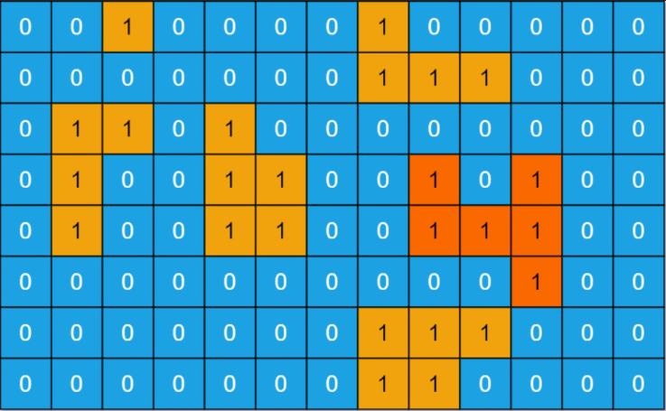

# 图&搜索算法

## [695. 岛屿的最大面积(Leetcode链接)](https://leetcode-cn.com/problems/max-area-of-island/)
给你一个大小为 m x n 的二进制矩阵 grid 。

岛屿 是由一些相邻的 1 (代表土地) 构成的组合，这里的「相邻」要求两个 1 必须在 水平或者竖直的四个方向上 相邻。你可以假设 grid 的四个边缘都被 0（代表水）包围着。

岛屿的面积是岛上值为 1 的单元格的数目。

计算并返回 grid 中最大的岛屿面积。如果没有岛屿，则返回面积为 0 。

示例 1：  
  
```
输入：grid = [[0,0,1,0,0,0,0,1,0,0,0,0,0],[0,0,0,0,0,0,0,1,1,1,0,0,0],[0,1,1,0,1,0,0,0,0,0,0,0,0],[0,1,0,0,1,1,0,0,1,0,1,0,0],[0,1,0,0,1,1,0,0,1,1,1,0,0],[0,0,0,0,0,0,0,0,0,0,1,0,0],[0,0,0,0,0,0,0,1,1,1,0,0,0],[0,0,0,0,0,0,0,1,1,0,0,0,0]]  
输出：6  
解释：答案不应该是 11 ，因为岛屿只能包含水平或垂直这四个方向上的 1 。  
```
示例 2：
```
输入：grid = [[0,0,0,0,0,0,0,0]]  
输出：0  
```
提示：
* m == grid.length
* n == grid[i].length
* 1 <= m, n <= 50
* grid[i][j] 为 0 或 1
## 解题思路

## 代码实现
Python
```
class Solution:
    def maxAreaOfIsland(self, grid: List[List[int]]) -> int:
        res = 0
        m, n = len(grid), len(grid[0])
        for i in range(m):
            for j in range(n):
                if grid[i][j]: res = max(res, self.dfs(grid, i, j, m, n))
        return res

    def dfs(self, grid: List[List[int]], i: int, j: int, m: int, n: int) -> int:
        area = 0
        if 0 <= i < m and 0 <= j < n and grid[i][j] == 1:
            grid[i][j] = 0
            area = 1 + self.dfs(grid, i - 1, j, m, n) + self.dfs(grid, i + 1, j, m, n) + self.dfs(grid, i, j - 1, m, n) + self.dfs(grid, i, j + 1, m, n)
        return area
```
Java
```
class Solution {
    public int maxAreaOfIsland(int[][] grid) {
        int res = 0;
        int m = grid.length, n = grid[0].length;
        for (int i = 0; i < m; ++i){
            for (int j = 0; j< n; ++j){
                if (grid[i][j] == 1){
                    res = Math.max(res, dfs(grid, i, j, m, n));
                }
            }
        }
        return res;
    }

    public int dfs(int[][] grid, int i, int j, int m, int n){
        int area = 0;
        if (0 <= i && i < m && 0 <= j && j < n && grid[i][j] == 1){
            grid[i][j] = 0;
            area = 1 + dfs(grid, i - 1, j, m, n) + dfs(grid, i + 1, j, m, n) + dfs(grid, i, j - 1, m, n) + dfs(grid, i, j + 1, m, n);
        }
        return area;
    }
}
```
