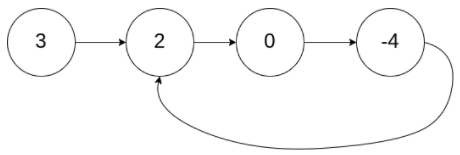
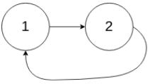
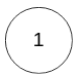

# 链表&双指针法
双指针法经常被是使用来解决链表的环问题。
## [142. 环形链表Ⅱ(Leetcode链接)](https://leetcode-cn.com/problems/linked-list-cycle-ii/)
给定一个链表，返回链表开始入环的第一个节点。 如果链表无环，则返回 null。

如果链表中有某个节点，可以通过连续跟踪 next 指针再次到达，则链表中存在环。 为了表示给定链表中的环，评测系统内部使用整数 pos 来表示链表尾连接到链表中的位置（索引从 0 开始）。如果 pos 是 -1，则在该链表中没有环。注意：pos 不作为参数进行传递，仅仅是为了标识链表的实际情况。

不允许修改 链表。

示例 1：


```
输入：head = [3,2,0,-4], pos = 1  
输出：返回索引为 1 的链表节点  
解释：链表中有一个环，其尾部连接到第二个节点。  
```
示例 2：


```
输入：head = [1,2], pos = 0  
输出：返回索引为 0 的链表节点  
解释：链表中有一个环，其尾部连接到第一个节点。  
```
示例 3：


```
输入：head = [1], pos = -1  
输出：返回 null  
解释：链表中没有环。  
```
提示：
* 链表中节点的数目范围在范围 [0, 104] 内
* -105 <= Node.val <= 105
* pos 的值为 -1 或者链表中的一个有效索引
 
进阶：你是否可以使用 O(1) 空间解决此题？

## 解题思路
1. 使用快慢指针法，从头开始，快指针每次移动两步，慢指针每次移动一步。
2. 当快慢指针相遇时，将头部赋给快指针，并与慢指针同时以每次一步的速度移动。
3. 当快慢指针再次相遇时，此时相遇的地点就是环的入口点，直接返回快慢指针中任一个即可。

## 代码实现
Python
```
class Solution:
    def detectCycle(self, head: ListNode) -> ListNode:
        low, fast = head, head
        while fast and fast.next:
            low = low.next
            fast = fast.next.next
            if low == fast:
                fast = head
                while low != fast:
                    low = low.next
                    fast = fast.next
                return fast
        return None
```
Java
```
public class Solution {
    public ListNode detectCycle(ListNode head) {
        ListNode slow = head, fast = head;
        while (fast != null && fast.next != null){
            slow = slow.next;
            fast = fast.next.next;
            if (slow == fast){
                fast = head;
                while (slow != fast){
                    slow = slow.next;
                    fast = fast.next;
                }
                return slow;
            }
        }
        return null;
    }
}
```
## [206. 反转链表(Leetcode链接)](https://leetcode-cn.com/problems/reverse-linked-list/)
给你单链表的头节点 head ，请你反转链表，并返回反转后的链表。

示例 1：
```
输入：head = [1,2,3,4,5]  
输出：[5,4,3,2,1]  
```
示例 2：
```
输入：head = [1,2]  
输出：[2,1]  
```
示例 3：
```
输入：head = []  
输出：[]  
```
提示：
*链表中节点的数目范围是 [0, 5000]
*-5000 <= Node.val <= 5000
 
进阶：链表可以选用迭代或递归方式完成反转。你能否用两种方法解决这道题？
## 解题思路
## 代码实现
Python
```
# Definition for singly-linked list.
# class ListNode:
#     def __init__(self, val=0, next=None):
#         self.val = val
#         self.next = next
class Solution:
    def reverseList(self, head: ListNode) -> ListNode:
        if not head or head.next == None:
            return head
        p = head
        q = None
        while p:
            tmp = p.next
            p.next = q
            q = p
            p = tmp
        return q
```
Java
```
/**
 * Definition for singly-linked list.
 * public class ListNode {
 *     int val;
 *     ListNode next;
 *     ListNode() {}
 *     ListNode(int val) { this.val = val; }
 *     ListNode(int val, ListNode next) { this.val = val; this.next = next; }
 * }
 */
class Solution {
    public ListNode reverseList(ListNode head) {
        ListNode p = head;
        ListNode q = null;
        while (p != null){
            ListNode tmp = p.next;
            p.next = q;
            q = p;
            p = tmp;
        }
        return q;
    }
}
```
